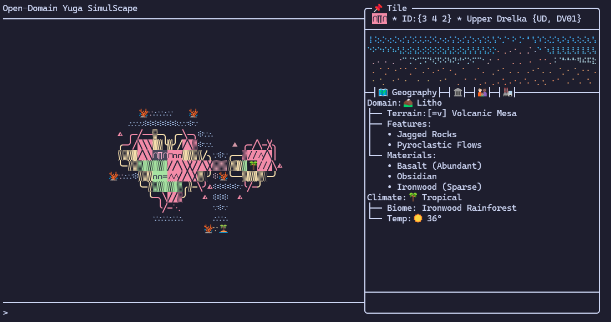

Henlo, welcome welcome. This here is my game and dev blog. I intend to tell you about some cool stuff. 

In the works are: 
1. My next [`Factorio:`](https://store.steampowered.com/app/427520/Factorio/)[`Space Age`](https://store.steampowered.com/app/645390/Factorio_Space_Age/) playthrough, which I want to document so that I plan things out a bit more and have less [spaghettification](https://en.wikipedia.org/wiki/Spaghettification). 
2. Getting back to devving my ambitious and eternally incomplete 4X TUI game. Here's a screen from the last time I had it compiling and running (before a major refactor 🫠).

:::center{width="80%"}

:::

3. Spinning up more homelab services. I want to hand roll some home data pipelines using [`Apache Airflow`](https://airflow.apache.org/) or otherwise.

:::center

:::

:::center
Umbasa. Stay tuned for more updates. 
:::
